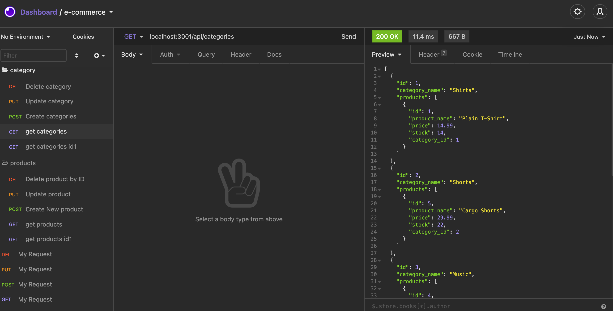
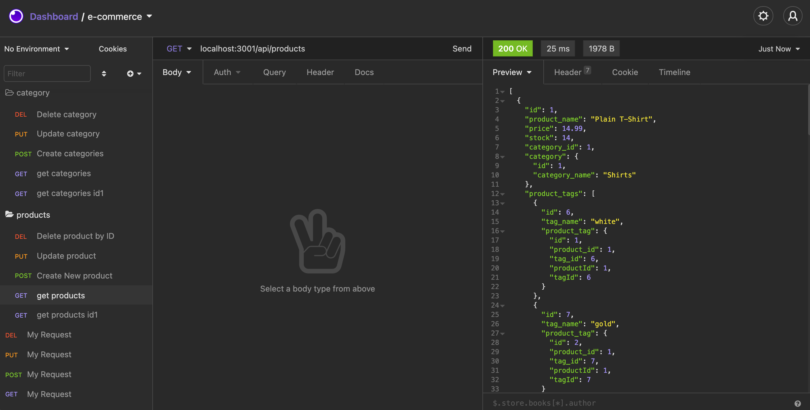
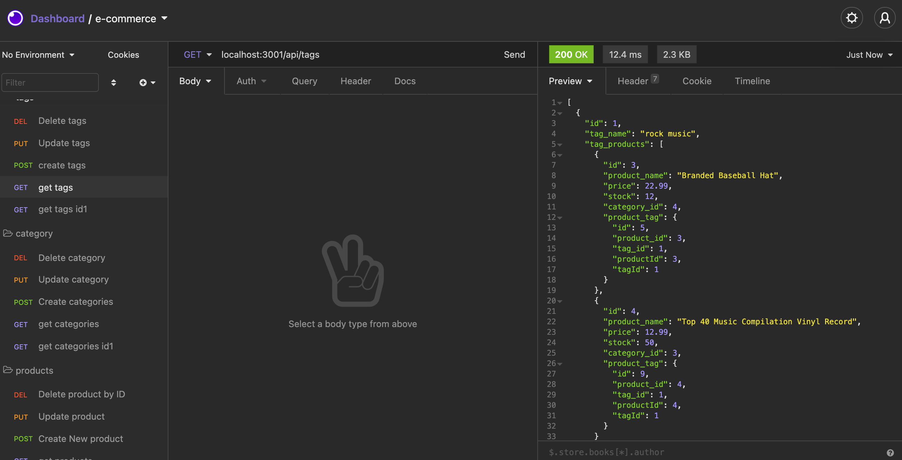

# e-commerce-backend

## Links:
Github: https://github.com/Yeatman51

Repository: https://github.com/Yeatman51/e-commerce-backend

Video displaying the CRUD method routing and functionality available with the link below 
(After clicking on the link below click on the button "View raw" to see the video)

Video Demo: https://github.com/Yeatman51/e-commerce-backend/blob/main/img/zoom_0.mp4
---

## Description:

This application implements and the crud method for an e-commerce website. Using Insomnia we are able to simulate digit post put and delete routing for different actions on the e-commerce platform.

This e-commerce backend utilizes and SQL database.

